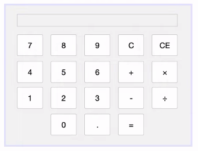
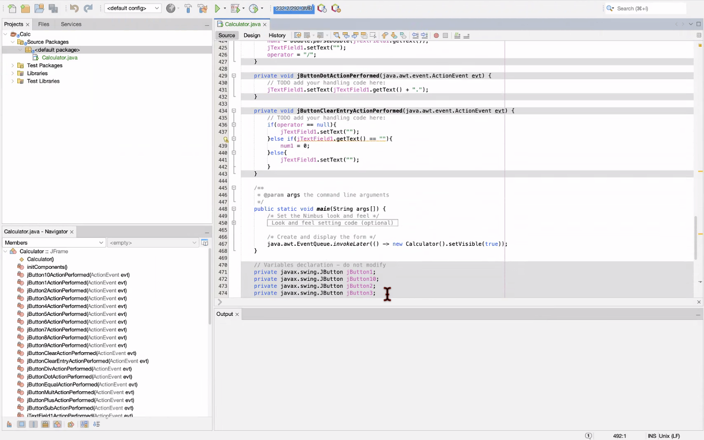

# Calculator
## Summary

This project is a working calculator created in the Java program language. 

## System
Product Version: Apache NetBeans IDE 26
Java: 24.0.1; OpenJDK 64-Bit Server VM 24.0.1+9

## Details




* You can press the number and operator buttons and they work properly

* Typing numbers and then one of the four operators and then hitting the equal button will show the resulting answer

* The C button erases everything

* The CE button erases the numbers right before

## Good Parts in the Code
```C#
private void jButtonClearEntryActionPerformed(java.awt.event.ActionEvent evt) {                                                  
        // TODO add your handling code here:
        if(operator == null){
            jTextField1.setText("");
        }else if(jTextField1.getText() == ""){
            num1 = 0; 
        }else{
            jTextField1.setText("");
        }
    }      
```
It was hard to make it so that the CE button erases the last number since it depends if you pressed one of the operators. 